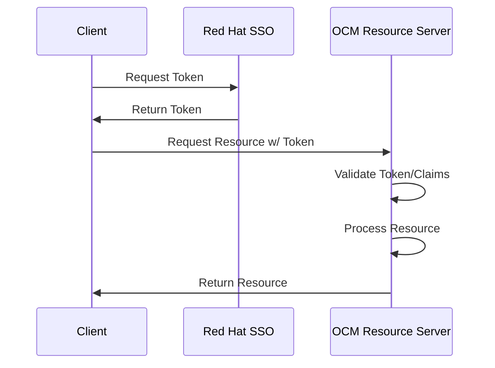

# Standard Claims

The [OCM Standard Claims](/pkg/middleware/standard_claims.go) are used to standardize bearer token claims for use within the various OCM APIs. This set of claims is [aligned on the recommended standards as defined by CIAM/SSO](https://source.redhat.com/groups/public/ciams/docs/external_sso_ssoredhatcom_claims__attributes).

For this documentation ["Resource Server"](https://www.oauth.com/oauth2-servers/the-resource-server/) and "Microservice" will be used interchangeably to describe an OCM API Server.

## OCM API Access Scope
In order to receive these standard claims a client must add the `api.ocm` [access scope](https://source.redhat.com/groups/public/ciams/docs/external_sso_ssoredhatcom_oauth_scopes#access-scopes) in their token request to SSO. Once a client receives a response from the token request, the client can then use the token containing our standard claims to communicate with OCM APIs. 

Clients need to ask SSO/CIAM to enable this scope on their client in order to use it.

#### Example: SSO Password Grant

The following is an example that can be executed against stage SSO using a password grant. As a note, password grants are not available against production SSO. See below for client credentials grant examples which can be used against production SSO.

```
curl --location --request POST 'https://sso.stage.redhat.com/auth/realms/redhat-external/protocol/openid-connect/token' \
--header 'Content-Type: application/x-www-form-urlencoded' \
--data-urlencode 'username=<username>' \
--data-urlencode 'password=<password> \
--data-urlencode 'grant_type=password' \
--data-urlencode 'client_id=cloud-services' \
--data-urlencode 'scope=openid api.ocm'
```

#### Example: SSO Client Credentials Grant
The following is an example that can be executed against stage/production SSO using a client credential grant. The typical use case for this grant is a service account that is used to make requests to OCM APIs. 

Service Accounts need to be explicitly enabled to use the `api.ocm` scope.

```
curl --location --request POST 'https://sso.stage.redhat.com/auth/realms/redhat-external/protocol/openid-connect/token' \
--header 'Content-Type: application/x-www-form-urlencoded' \
--data-urlencode 'grant_type=client_credentials' \
--data-urlencode 'client_id=<client_id>' \
--data-urlencode 'client_secret=<client_secret>' \
--data-urlencode 'scope=api.ocm'
```

## Auth Flow for OCM Resource Servers
The following is a simplified representation of the path a client takes to access an OCM Resource Server. This is a standard OIDC Authorization Code Flow where the client requests a token from the authorization server and then uses that token to access the OCM Resource Server. The OCM Resource Server then validates the token and processes the request.




## Usage

#### ...in a new OCM Resource Server (Microservice)
When creating a new OCM microservice it is important to conform to the OCM standard claims that are a product of the access scope. It is recommended to fork the new microservice from the [OCM Example Service](https://gitlab.cee.redhat.com/service/sdb-ocm-example-service). This service is a template that can be used to quickly bootstrap a new OCM microservice. It will include the necessary dependencies and configuration to leverage the OCM Standard Claims inherently.

#### Access Scope Validation
OCM Resource Servers should validate that the scope and audience claims contain `api.ocm`. It is possible that a service account has a hard-coded audience claim that does not contain `api.ocm` and in this case we can only validate that the scope is correct. When validation fails on these claims the microservice should return an error response.

The `VerifyOCMClaims` helper function provides a validation helper of this functionality out-of-the-box. It is up to the service to leverage this in the middleware and return the correct response where applicable.